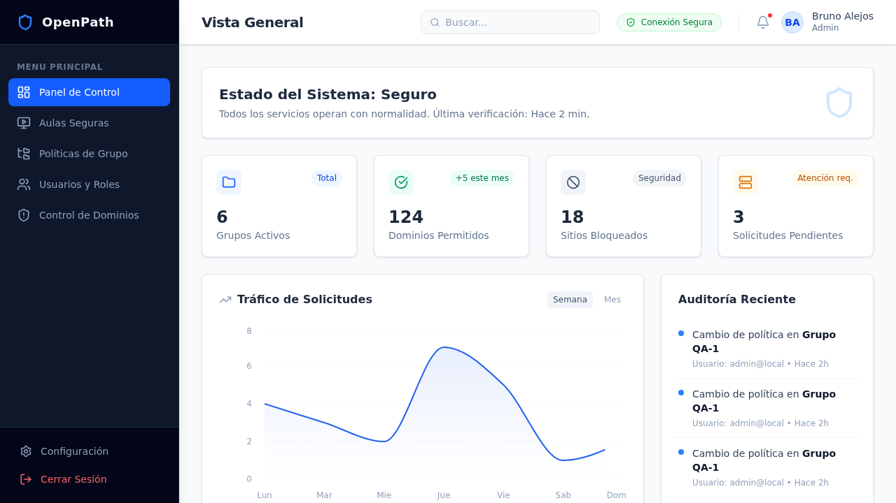

# OpenPath

> Status: maintained
> Applies to: OpenPath repository
> Last verified: 2026-04-13
> Source of truth: `README.md`

[](https://github.com/balejosg/openpath/actions/workflows/ci.yml)
[](https://app.codecov.io/github/balejosg/openpath)

OpenPath is the auditable OSS core for intentional internet access in education and other shared-device environments.
It gives school IT teams and operators a transparent foundation for deciding what opens, what stays blocked, and how that policy reaches endpoints.

It combines:

- a Node.js/TypeScript API with tRPC and PostgreSQL
- a React SPA consumed directly and through stable downstream integrations
- Linux and Windows endpoint agents
- a Firefox-focused browser extension with managed Firefox/Chromium distribution helpers

OpenPath stays agnostic of downstream wrappers, managed distributions, and tenant-specific overlays.



## Why School IT Teams Evaluate OpenPath

- **Auditable core:** the engine, admin surface, endpoint agents, and browser integration live in this repository.
- **Endpoint-first enforcement:** Linux and Windows agents apply policy locally instead of relying only on browser settings.
- **Operational visibility:** the browser extension helps diagnose blocked resources during rollout and support workflows.
- **Clear trust boundary:** downstream integrations consume a documented public surface instead of deep, unstable internals.

Maintained repo documentation is English-only and indexed from [`docs/INDEX.md`](docs/INDEX.md). Historical records such as [`CHANGELOG.md`](CHANGELOG.md) and most ADR files are useful context, but they are not install or operations runbooks.

## Choose Your Starting Point

| If you need...                                                     | Start here                                                                                     |
| ------------------------------------------------------------------ | ---------------------------------------------------------------------------------------------- |
| A self-hosted, modifiable core that your team can operate directly | [`docs/evaluation/adoption-path.md`](docs/evaluation/adoption-path.md)                         |
| Self-hosting prerequisites and ownership boundaries                | [`docs/evaluation/self-hosted-prerequisites.md`](docs/evaluation/self-hosted-prerequisites.md) |
| Recommended deployment shapes                                      | [`docs/evaluation/deployment-shapes.md`](docs/evaluation/deployment-shapes.md)                 |
| What the project provides vs. what your team must own              | [`docs/evaluation/support-boundaries.md`](docs/evaluation/support-boundaries.md)               |
| The canonical architecture and public contracts                    | [`docs/ADR.md`](docs/ADR.md)                                                                   |
| Operator hardening and rollout guidance                            | [`docs/SECURITY-HARDENING.md`](docs/SECURITY-HARDENING.md)                                     |
| Package and platform entrypoints                                   | [`docs/INDEX.md`](docs/INDEX.md)                                                               |

## What Ships Today

- [`api/`](api/README.md): Express + tRPC service, setup flow, public request endpoints, agent delivery endpoints, and exports
- [`react-spa/`](react-spa/README.md): OSS administration UI plus the supported downstream public entrypoints
- [`linux/`](linux/README.md): Debian/Ubuntu agent using `dnsmasq`, firewall rules, SSE updates, and self-update tooling
- [`windows/`](windows/README.md): PowerShell agent using Acrylic DNS Proxy, Windows Firewall, scheduled tasks, and browser policy rollout
- [`firefox-extension/`](firefox-extension/README.md): extension build/signing/distribution pipeline and optional native host
- [`shared/`](shared/README.md): shared Zod schemas, domain helpers, classroom status types, rule validation, and roles
- [`dashboard/`](dashboard/README.md): Express compatibility layer that proxies legacy REST-style flows to API tRPC routes

## Trust And Security References

- Security disclosure and hardening baseline: [`SECURITY.md`](SECURITY.md)
- Operator hardening checklist: [`docs/SECURITY-HARDENING.md`](docs/SECURITY-HARDENING.md)
- Browser extension privacy posture: [`firefox-extension/PRIVACY.md`](firefox-extension/PRIVACY.md)
- Public SPA integration boundary: [`docs/adr/0010-public-spa-extension-surface.md`](docs/adr/0010-public-spa-extension-surface.md)
- License and commercial boundary: [`LICENSING.md`](LICENSING.md)

## Local Development

From repo root:

```bash
npm install
npm run build --workspaces --if-present
```

Common entrypoints:

```bash
npm run dev --workspace=@openpath/api
npm run dev --workspace=@openpath/react-spa
npm run dev --workspace=@openpath/dashboard
```

Platform-specific agents:

- Linux installer/runtime: [`linux/README.md`](linux/README.md)
- Windows installer/runtime: [`windows/README.md`](windows/README.md)

## Verification

Recommended local checks:

```bash
npm run verify:agent
npm run verify:quick
npm run verify:docs
```

Targeted examples:

```bash
npm run test:api
npm run test:react-spa
npm run test:e2e:smoke
npm test --workspace=@openpath/firefox-extension
```

The full documentation map lives in [`docs/INDEX.md`](docs/INDEX.md). Contributor and agent workflow details live in [`CONTRIBUTING.md`](CONTRIBUTING.md) and [`AGENTS.md`](AGENTS.md).

## License

OpenPath is licensed under `AGPL-3.0-or-later`. See [`LICENSING.md`](LICENSING.md).
